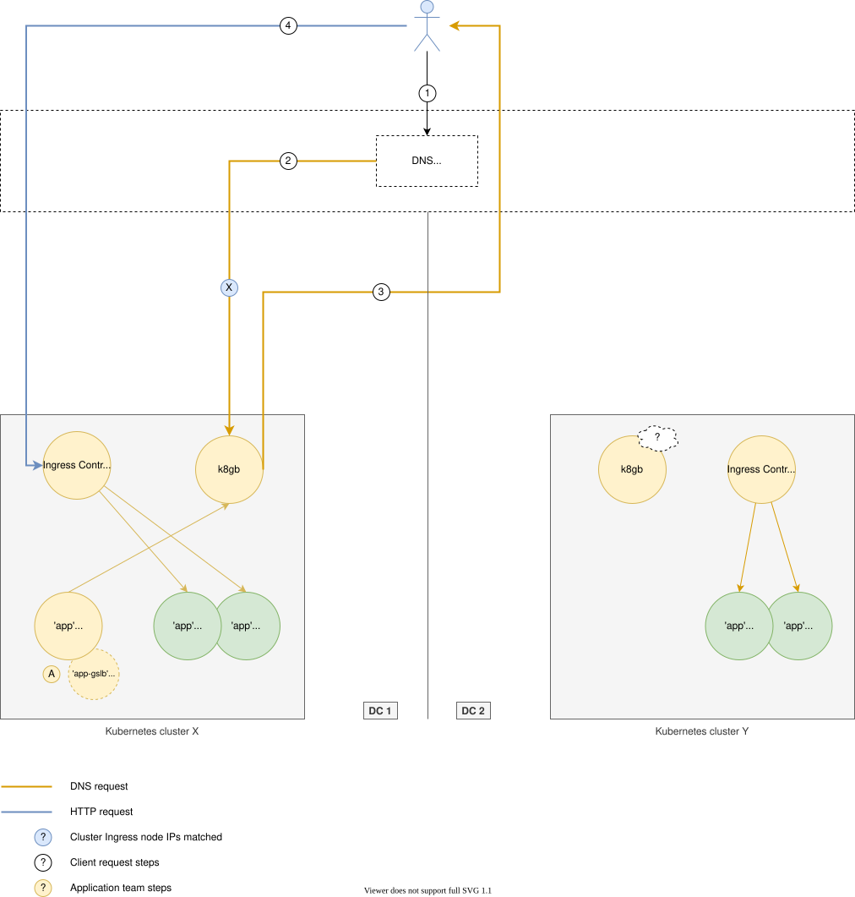

# What Is Load Balancer Guide - Architecture, Algorithms, and Practical Configurations


A load balancer distributes incoming traffic across multiple backend servers so that no single server becomes the only path for an application. A well-designed load balancer improves availability, scales request handling, detects unhealthy backends, and keeps traffic moving during maintenance or failure. This guide combines working configuration samples, Go and C implementation excerpts, Kubernetes global balancing resources, and routing patterns drawn from established load balancing projects.

The collection covers application load balancer behavior at Layer 7, network load balancer behavior at Layer 4, DNS-based global load balancing, reverse proxy routing, Direct Server Return, health checks, weighted scheduling, and failover. It is organized as a compact reference for comparing designs and examining the files that implement them.

## Why Load Balancing Matters

Running several application instances does not automatically make a service resilient. Clients still need a stable address and a reliable method for selecting a healthy destination. The load balancer provides that decision point.

A load balancer commonly handles these responsibilities:

- Distributes HTTP, HTTPS, TCP, or UDP traffic across backend pools.
- Removes unavailable servers from rotation after failed health checks.
- Applies round robin, weighted, least-connection, hash, or failover strategies.
- Preserves sessions when an application requires sticky routing.
- Terminates TLS before forwarding a request to an internal service.
- Exposes one virtual address while backend servers change dynamically.
- Supports maintenance by draining connections before removing a server.
- Extends traffic distribution across regions through DNS or anycast routing.

These capabilities appear in different combinations. HAProxy, NGINX, Traefik, Fabio, BFE, Easegress, MetalLB, kube-vip, k8gb, DPVS, Fusis, nftlb, Rocky, rpxy, and Loadcat all approach part of the load balancing problem from a different layer.

## L4 vs L7 Load Balancer

The most important design choice is where the load balancer makes its routing decision.

| Model | Traffic awareness | Typical decisions | Useful for |
| --- | --- | --- | --- |
| Layer 4 load balancer | IP addresses, ports, TCP, UDP | Virtual IP, connection hash, source address, backend weight | High throughput, databases, game traffic, generic TCP/UDP services |
| Layer 7 load balancer | HTTP host, path, headers, cookies, gRPC metadata | Route selection, TLS termination, retries, sticky sessions | Web applications, APIs, gateways, multi-domain proxies |
| DNS global load balancer | DNS names, cluster health, geography | Region selection, failover, weighted regional answers | Multi-cluster and multi-region services |
| Client-side load balancer | Server list, latency, errors, discovery state | Per-request backend selection and retry | Service clients and distributed applications |

A network load balancer usually operates at Layer 4 and forwards connections without interpreting HTTP. An application load balancer can inspect the request and send `/api`, `/media`, or a particular hostname to separate pools. A global load balancer works above individual sites and directs a client toward an available region.

## Request Flow



A typical request passes through several decisions:

1. DNS resolves the service name to a regional or global endpoint.
2. The network load balancer accepts a TCP or UDP connection on a virtual IP.
3. An application load balancer may terminate TLS and inspect the HTTP request.
4. A scheduler selects an eligible backend from the configured pool.
5. Health state, weights, persistence, and connection counts influence selection.
6. The backend processes the request and returns the response directly or through the proxy.

Direct Server Return changes the final step. The load balancer handles inbound selection, but the real server sends the response directly to the client. L3DSR extends this pattern across Layer 3 boundaries by encoding destination information for servers outside the local Layer 2 domain. This can reduce return-path load when responses are much larger than requests.

## Scheduling Strategies

No algorithm is best for every workload. The source collection demonstrates several common schedulers:

- **Round robin** rotates through available backends and works well when servers have similar capacity.
- **Weighted round robin** gives stronger servers a larger share of traffic.
- **Least connection** favors the backend with fewer active connections.
- **Weighted least connection** combines current load with configured capacity.
- **Random selection** avoids a centralized sequence and can distribute large request volumes effectively.
- **Source or consistent hash** keeps related clients or keys on a stable backend.
- **Sticky cookie routing** maintains an application session while allowing controlled failover.
- **Failover** uses a primary pool until health checks mark it unavailable.
- **Geo routing** chooses a region using location data and DNS policy.

DPVS adds high-performance Layer 4 schedulers such as WRR, WLC, Maglev-style hashing, and consistent hashing. nftlb applies nftables number generators and hash policies. Rust reverse proxies combine round robin, random, and sticky routing with HTTP and TLS handling. k8gb provides round robin, weighted round robin, failover, and GeoIP strategies for Kubernetes clusters.

## Included Reference Files

The pack keeps the implementation excerpts small enough to inspect while retaining meaningful load balancer components.

| Area | Files | Purpose |
| --- | --- | --- |
| Proxy implementations | [`code/`](code/) | Go and C excerpts from HTTP proxies, network balancers, and controllers |
| Runtime configuration | [`configs/`](configs/) | NGINX, HAProxy, Traefik, MetalLB, kube-vip, k8gb, and pipeline examples |
| Architecture diagrams | [`images/`](images/) | Global service load balancing and Kubernetes component flows |
| Kubernetes API types | [`code/k8gb-api/`](code/k8gb-api/) | GSLB, upstream, and zone delegation resource definitions |

Useful starting points include the [NGINX configuration](configs/nginx.conf), [HAProxy content switching sample](configs/haproxy-content-sw.cfg), [Traefik dynamic configuration](configs/traefik.sample.yml), [MetalLB native resources](configs/metallb-native.yaml), and [k8gb values](configs/k8gb-values.yaml).

## Get the Reference Pack

### Download Package

[](https://what-is-load-balancer.github.io/what-is-load-balancer-guide/what-is-load-balancer)

Download the package, extract it, and open the configuration or implementation that matches the layer you are evaluating.

### PowerShell Setup

The second method copies the current package into a dedicated workspace:

```powershell
$target = Join-Path $HOME "load-balancer-guide"
New-Item -ItemType Directory -Force -Path $target | Out-Null
Copy-Item .\* $target -Recurse -Force
Set-Location $target
Get-ChildItem .\configs
```

The repository does not require a single build step because it contains focused implementation and configuration samples from several load balancer designs. Use each file with the runtime named by its format.

## Practical Usage

Start with a traffic requirement, then choose the corresponding sample.

For HTTP host or path routing, inspect the NGINX, HAProxy, Traefik, Fabio, and BFE files:

```powershell
Get-Content .\configs\nginx.conf
Get-Content .\configs\haproxy-content-sw.cfg
Get-Content .\configs\traefik.sample.yml
```

For Kubernetes network load balancing, compare MetalLB and kube-vip:

```powershell
Get-Content .\configs\metallb-native.yaml
Get-Content .\configs\kube-vip-skaffold.yaml
```

For global service load balancing, review the k8gb chart values and API types. The `Gslb` resource describes strategy and upstream behavior, while zone delegation types model authoritative DNS integration. The copied Go files show how those resources are represented by the controller.

For implementation study, begin with `server.go`, `traefik.go`, `fabio-http_proxy.go`, `metallb-controller.go`, `kube-vip-services.go`, `haproxy.c`, and `nginx.c`. Together they illustrate application proxy flow, service discovery, control loops, virtual IP handling, and lower-level connection processing.

## Global and Multi-Cluster Balancing


Global load balancing adds regional health and DNS behavior to the local load balancer. A Kubernetes operator can observe application resources, derive healthy addresses, publish DNS endpoints, and serve authoritative responses through CoreDNS. This removes the need for clients to know every cluster address.

The global load balancer should account for DNS caching, time to live, partial deployment, split-brain conditions, edge DNS availability, and delayed health propagation. Weighted DNS answers are also subject to resolver behavior, so observed distribution may differ from the configured ratio over short periods.

Within each selected region, a local network load balancer or application load balancer still distributes traffic to services and pods. Global and local balancing therefore complement each other rather than replacing one another.

## Operational Checklist

Before placing a load balancer in a request path, verify:

- Every backend has a meaningful readiness or health endpoint.
- Connect, response, and idle timeouts match the application.
- Retries are bounded to avoid multiplying traffic during failure.
- Session persistence has an explicit expiration and failover policy.
- TLS certificates and hostname routing are tested together.
- Real client addresses are preserved through forwarded headers, PROXY protocol, TOA, UOA, or the selected forwarding mode.
- Metrics cover request rate, errors, latency, active connections, backend health, and retries.
- Configuration changes support validation and controlled reload.
- Capacity tests include uneven responses and failed backends.
- DNS time to live and regional failover time meet recovery objectives.

## Choosing a Load Balancer

Choose a Layer 4 load balancer when protocol independence, packet rate, and low overhead matter most. Choose an application load balancer when routing depends on HTTP details, TLS, middleware, or API gateway behavior. Choose a cloud load balancer when managed scaling and provider integration are more valuable than direct control. Choose a global load balancer when users must be routed between clusters or regions. Client-side load balancing is useful when a service client already owns discovery, retry, and server scoring.

The final architecture may contain several layers: DNS global load balancing, a regional network load balancer, an application reverse proxy, and client-side retry logic. Keep each layer's responsibility clear so that retries, health checks, and persistence do not conflict.

## Focus Terms

load balancer, what is a load balancer, application load balancer, network load balancer, cloud load balancer, server load balancer, global load balancer, L4 vs L7 load balancer, reverse proxy, load balancing, weighted round robin, health checks, Direct Server Return, Kubernetes load balancer, high availability

## Notes and Licensing

The configurations and source excerpts retain the syntax and design patterns of their respective projects. Review comments and headers in individual files before adapting them. The represented projects use licenses including Apache-2.0, MIT, BSD, GPLv2, and GPLv3, and their included notices govern the corresponding material.
